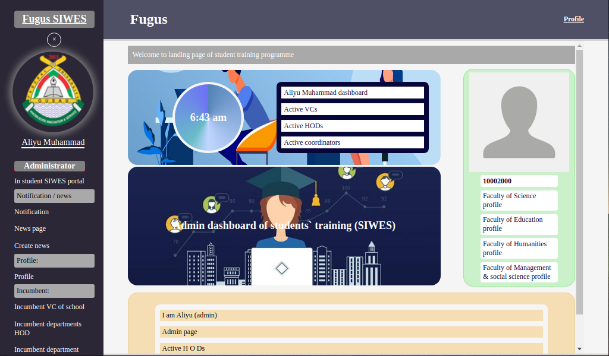
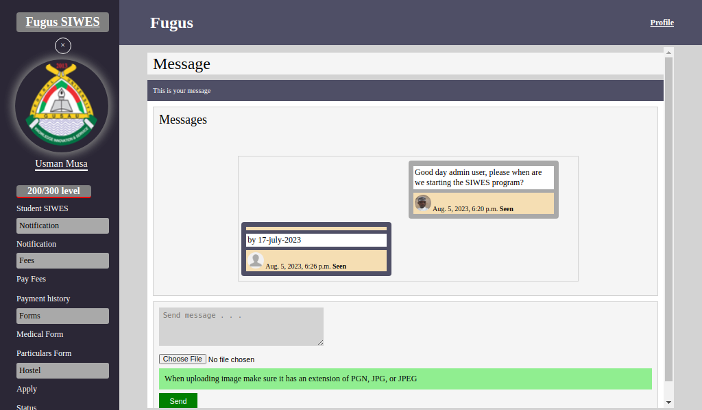
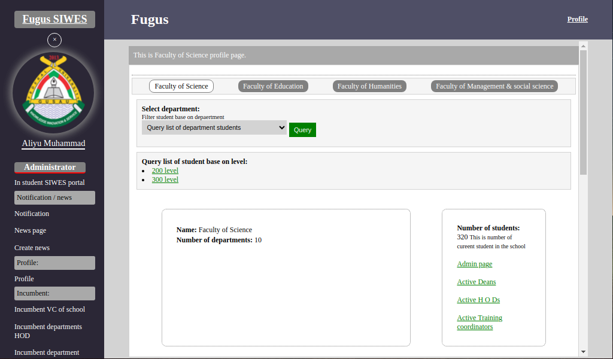
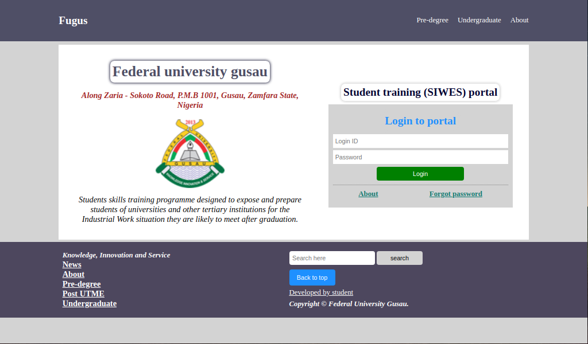

# Development of e-SIWES Portal

A Web based Platform for Student Industrial Work Experience Scheme `(SIWES)` Management, developed for Federal University Gusau (`FUG`), which help and also digitalized students' `SIWES` activities.

> **Warning**
> This project (source code) has been totally moved to private, send feed back @ usmanmusa1920@gmail.com

**Declaration**

I, Usman Musa (2010310013), certify that this project is my own work, based on my personal experience, study and research. I also certify that it is not copied in part or whole or otherwise the work of other persons. I confirm that I have identified and declared all possible conflicts that I may have.

It was carried out at (mostly holiday, also while doing my SIWES program at Zaria old water works), which took me a period of six months to finish it (from February 2023, to August 2023) during which I was exposed for developing the portal.

**Acknowledgments**

I would like to express my deepest special appreciation, gratitude and thanks to my parent, whose contribution in encouragement, helped me to coordinate my experiments especially for this project.

## Introduction

A portal system can be described in different ways depending on differing point of views. To a user of a portal, it is a web system that provides the functions and features to authenticate and identify users. It provides an easy, intuitive, personalized and user-customizable web-interface for facilitating access to information and services that are of primary relevance and interests to them. However, to the organization that sets up the portal, it is a system that helps the organization to catalogue or organize collections of different and multiple sources of information for dissemination to many users according to their specific privileges, needs and interests. Therefore, the main purpose for setting up a portal is to bring vast information and resources available from many sources to many users in an effective manner.

The e-SIWES portal was developed in order to enhance the manual task of carrying out SIWES activities by students, supervisors, SIWES coordinators and the administrators during the course of the SIWES, such as sharing acceptance and placement letter to student, registration, dissemination of information, filling of log book for students day-to-day activities and supervision/assessment by supervisors. The portal is web based and allows all tasks to be carried out using the personal computer/mobile device and the internet. I digitized the SIWES logbook (scan logbook in hardcopy and upload it) by students and grading by the supervisors electronically. This will allow supervisors to be assigned immediately the students commence their industrial training and facilitate their monitoring in real-time. With the e-SIWES portal, important messages can be broadcast to all students at once and on a prompt and regular basis, by staffs through the news page.

There have been several efforts in Nigeria and in other parts of the world to build portal systems that can facilitate administration and learning in higher institutions.

## Brief about SIWES

In the early stage of science and technology education in Nigeria, students were graduating from their respective institutions with little or no technical knowledge or working experience. It was in view of this that students studying science and technology related courses in different institutions were mandated to undergo the Student Industrial Work Experience Scheme `(SIWES)` so as to widen their horizons and to enable them have technical knowledge or working experience before graduating from their various institutions.

The Student Industrial Work Experience Scheme `(SIWES)` was established by the Industrial Training Fund (ITF) in _1973_. ITF has operated consistently and painstakingly within the context of its enabling laws, i.e. Decree 47 of 1971. The objective for which the Fund was established has been pursued vigorously and efficaciously. In the three decades of its existence, the ITF has not only raised training consciousness in the economy, but has also helped in generating a corps of skilled indigenous manpower which has been manning and managing various sectors of the national economy.

SIWES (Student’s Industrial Work Experience Scheme) is a scheme for the duration of (6 months). Participation in SIWES has become a necessary pre-condition for the award of Diploma and Degree certificates in specific disciplines in most institutions of higher learning in Nigeria. SIWES is done after the first year in polytechnics (ND1); and done after Second year or third year in Universities depending on the institutions.

## Activities

Activities in this e-SIWES port may be independent or inter-related for the user groups. Major (most of the SIWES) activities are done by these user groups `(administrator, coordinator, supervisor, and student)`. The following are some list of functional requirements for the e-SIWES portal for users base on their privileges `(admin, coordinator, supervisor, and student)`.

-   Administrator creates accounts for all user groups, these include:
    -   VC, Hod, Coordinators, Supervisors,
    -   Students that are eligible to go for the SIWES program,
    -   Also create another admin user.
-   Release of session every year, by administrator user.
-   Assigning a set of supervisors to departments active coordinators by administrator.
-   Release of departmental letter (placement and acceptance) simultaneously by department coordinator.
-   SIWES coordinator assigns a set of students to a supervisor from the institution.
-   Supervisor, supervise activities of students on SIWES and comment and grade them on weekly basis.
-   Submission of student logbook (after marking) i.e result, by student supervisor to student coordinator.
-   Student coordinator approve student result (after supervisor) submitted it.
-   Users log into the portal are identified with unique login ID & password as assigned by the school and as stored in database.
-   Student apply for the SIWES program for the level (200 and then later 300).
-   Student print acceptance and placement letter.
-   Student upload his/her acceptance letter, after the Organization/Institution/Company he/she want to go accepted him.
-   Students can fill their logbooks (scan logbook in hardcopy and upload it), and view their logbook entry per week.
-   Coordinators, supervisors, students can send and receive messages to each other.

## Screen shot

These are 4 screen shot of some of the e-SIWES portal pages, _Landing page_, _Chat room page_, _Faculty page_, and _Login page_ respectively:

## Conclusion

With this work, e-SIWES portal is now a tangible platform for efficient web based administration of SIWES tasks (activities) either the students are undergoing the program within or outside Nigeria.

Quite a number of students in both public and private higher institutions currently travel abroad to undertake the SIWES program. This is actually a very good development both for the country and for the students. However, monitoring such students has always been a very tedious task. The newly developed e-SIWES portal is a timely and adequate solution to this problem and host of other administrative based challenges that have bedeviled the SIWES program over the years. This will help us to undertake a comparative evaluation of the existing manual approach to the electronic approach for SIWES activities using the e-SIWES portal.

Good documentations is also included within the code itself, that make who so ever (programmer) reading the code (trying to change something) to know what is going on. The site (static page) can be reach via github page of the repository: <a href="https://usmanmusa1920.github.io/siwes">https://usmanmusa1920.github.io/siwes</a>, which from there you might see the actual site link. The entire code of this project is no longer public now on this github repository <a href="https://github.com/usmanmusa1920/siwes">https://github.com/usmanmusa1920/siwes</a>

> **Note**
> This project (source code) has been totally moved to private, send feed back @ usmanmusa1920@gmail.com
